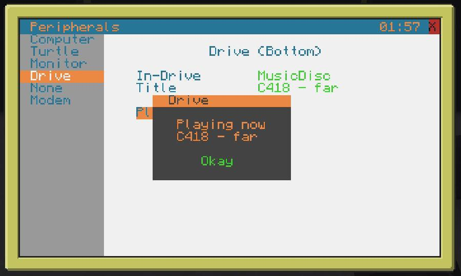
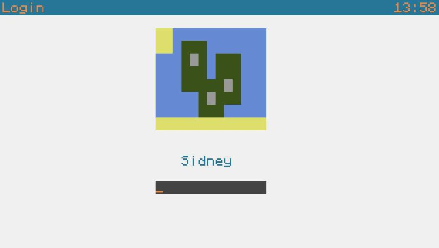
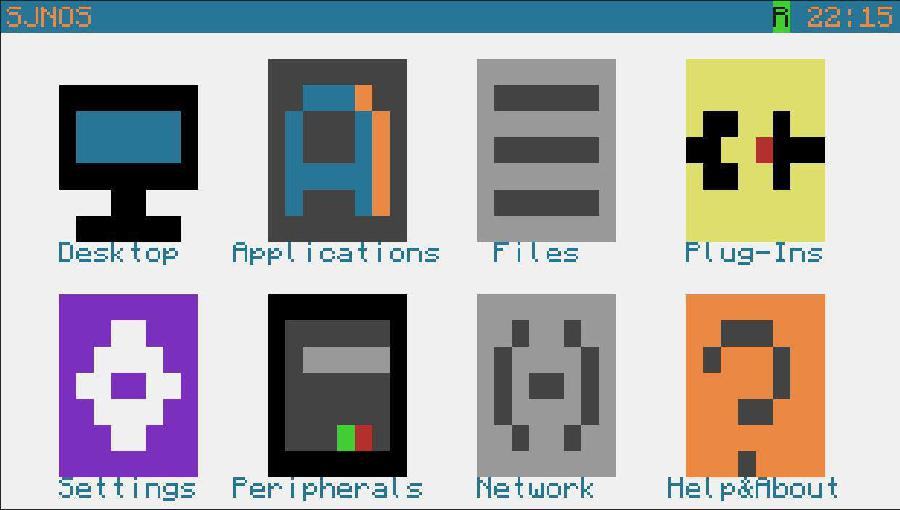
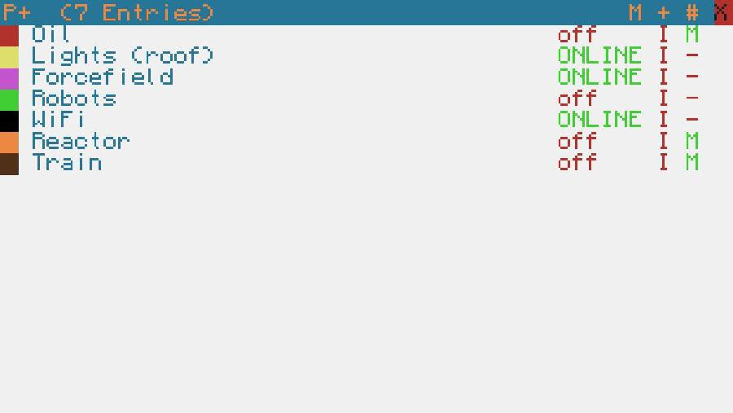
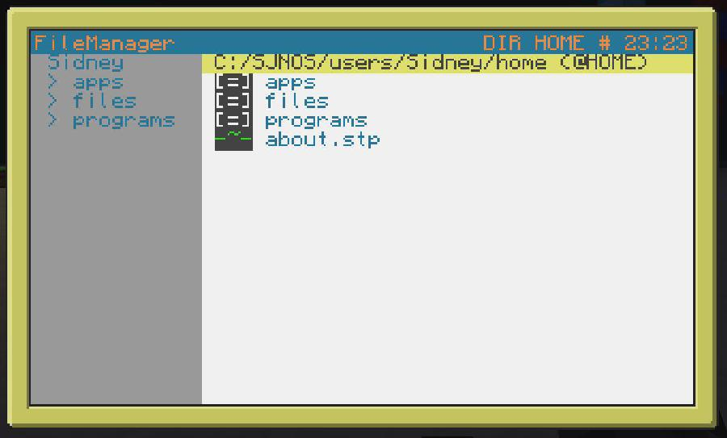
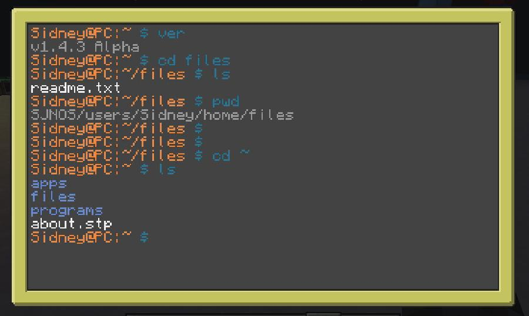
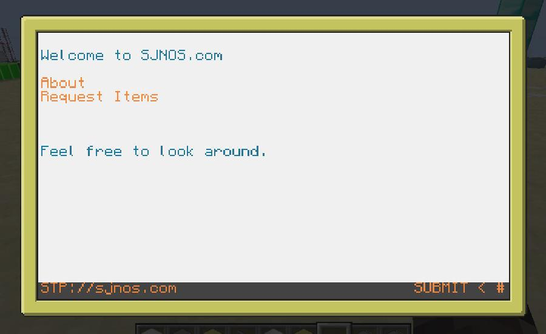
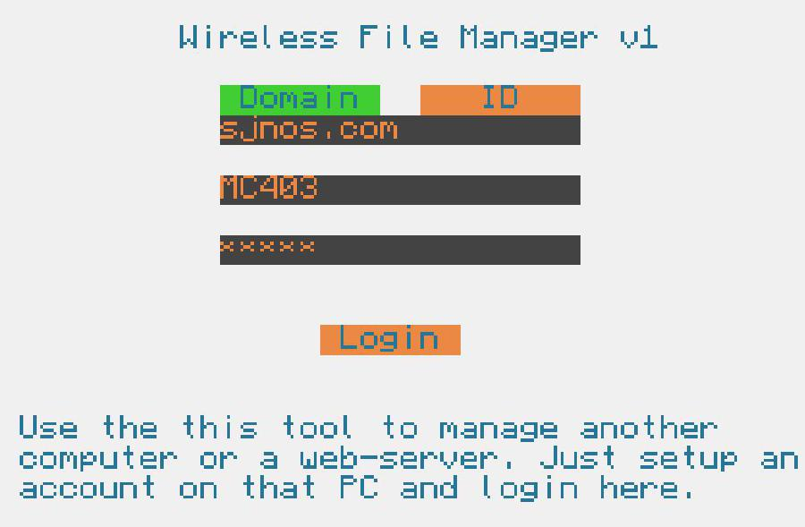
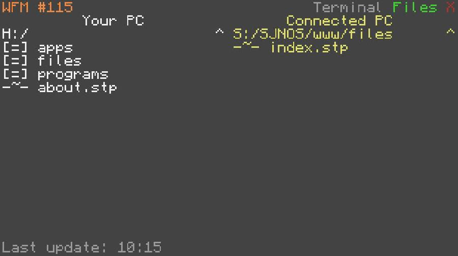

# sjnos-for-minecraft (discontinued)

> I worked on this project between the age of 15 and 17. It is written in Lua and uses Pastebin in its build pipeline, so expect it to be very rough around the edges.

_SJNOS_ is a sophisticated user interface for
computers in a modification of the game [Minecraft][mc]. It provides tools to manage industrial structures and helps with daily tasks.

It requires [Computercraft][cc] (v1.5+) and was designed for [Tekkit Lite][tklite].

Main Features:

- Desktop-like User Interface
- Utilities for managing Electricity (Redstone)
- Utilities for Computercraft: GPS, Printers, Monitors, Disk Drives
- File Explorer and Terminal
- Internet-like Server/Client Communication, Web-Browser, File Transfer



## Installation
After installing Computercraft, type inside a golden computer:

```
> pastebin get A343Rqi6 install.lua
> install.lua
```
Follow the steps in the installer.


## Gallery

### Login

Login into your personal account. Allows multiple users on every computer.

### Desktop

Start apps and work on tasks.

### Redstone

Attach wires and manage complex systems, like factories, reactors or farms.

### File Manager

Edit files and run your own programs.

### Terminal

Execute commands in the (slightly) UNIX-like terminal.


### Website

Design a website by using a HTML-like language. You can easily set up a second computer as a server and connect to it.

### Wireless File Manager

Login to your remote server and upload new files, like programs, images or your new website.



## About

Made by Sidney Neffe from 2014 to 2016.

Approx. 13,000 lines of code


[cc]:https://www.computercraft.info/wiki/Main_Page
[mc]:https://minecraft.net
[tklite]:https://tekkitlite.fandom.com/de/wiki/Tekkit_Lite_Wiki
